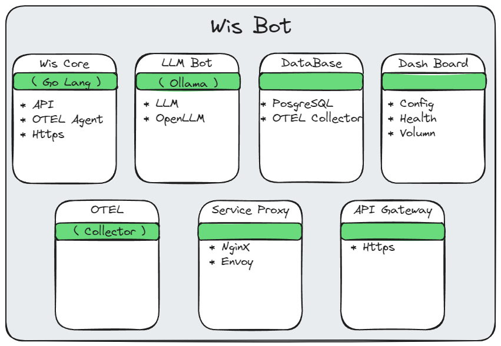

# Introduction & Table of Contents

## WisBot

A bot for the automation of things

- [Introduction \& Table of Contents](#introduction--table-of-contents)
  - [WisBot](#wisbot)
  - [Getting Started](#getting-started)
    - [Start using Wisbot with Commands](#start-using-wisbot-with-commands)
  - [Architecture](#architecture)
    - [WisBot Design Architecture](#wisbot-design-architecture)
    - [User Experience Workflows](#user-experience-workflows)
  - [Commands](#commands)
  - [Requirements \& Dependencies](#requirements--dependencies)
    - [Bot Dependencies](#bot-dependencies)
      - [Templ \& Air](#templ--air)
  - [Running the bot](#running-the-bot)
    - [Running the bot using Go](#running-the-bot-using-go)
  - [Using Docker to build and deploy Wisbot](#using-docker-to-build-and-deploy-wisbot)
    - [Building the Docker Image](#building-the-docker-image)
    - [Running the bot using docker-compose](#running-the-bot-using-docker-compose)
      - [Running the dockerfile with GPU acceleration enabled:](#running-the-dockerfile-with-gpu-acceleration-enabled)
  - [Ollama Docker Image Documentation](#ollama-docker-image-documentation)

## Getting Started

### Start using Wisbot with [Commands](#commands)

## Architecture

### WisBot Design Architecture



### User Experience Workflows


## Commands

`/wis help` - Shows the help message

`/wis upload` - Uploads a file to the server

`/wis llm` - Sends a request to the attached WisBot LLM


## Requirements & Dependencies
- Golang 1.23
- Templ (optional)
- Discord Token
- Ollama (optional)
- Llama3.2 model `ollama pull llama3.2`
- Nvidia Container Toolkit (optional)

### Bot Dependencies
After the installation of Go, the following tools are recommended for development. Please install them using the commands below:

#### Templ & Air

- A language for writing HTML user interfaces in Go - https://github.com/a-h/templ
- Live reload for Go apps - https://github.com/air-verse/air
  
```sh
go install github.com/a-h/templ/cmd/templ@latest && go install github.com/air-verse/air@latest
```

Then run air in the WisBot repository to update all required dependencies:
```sh
air
```

## Running the bot
> [!NOTE]
You will need a config.yaml file, if you don't have one, one will be created for you on the first run.
Please fill out the config. This is for Discord authentication. You can get the token from the Discord Developer Portal.

### Running the bot using Go

You can run the bot using the following command:
```sh
go run ./src
```

## Using Docker to build and deploy Wisbot

### Building the Docker Image

Update the latest build of the wisbot:

```sh
docker build -t wisbot .
```

Running the dockerfile via Docker:

[docker run](https://docs.docker.com/reference/cli/docker/container/run/)

```sh
docker run -d wisbot
```

### Running the bot using docker-compose

[docker compose](https://docs.docker.com/compose/)

```sh
docker compose up -d
```

Running the WisBot via Docker Compose (testing workflow):

```sh
docker compose -f test-compose.yaml up
```

#### Running the dockerfile with GPU acceleration enabled:

Enable Nvidia Container Toolkit resources on Ubuntu 22.04 WSL:

[nvidia container toolkit](https://docs.nvidia.com/datacenter/cloud-native/container-toolkit/latest/install-guide.html#prerequisites)

```sh
curl -fsSL https://nvidia.github.io/libnvidia-container/gpgkey | sudo gpg --dearmor -o /usr/share/keyrings/nvidia-container-toolkit-keyring.gpg && curl -s -L https://nvidia.github.io/libnvidia-container/stable/deb/nvidia-container-toolkit.list | sed 's#deb https://#deb [signed-by=/usr/share/keyrings/nvidia-container-toolkit-keyring.gpg] https://#g' | sudo tee /etc/apt/sources.list.d/nvidia-container-toolkit.list
```

Update the package list and install the Nvidia Container Toolkit:

```sh
sudo apt-get update && sudo apt-get install -y nvidia-container-toolkit
```

Configure Docker to use the nvidia-container-toolkit:

```sh
sudo nvidia-ctk runtime configure --runtime=docker && sudo systemctl restart docker
```

Run the image with GPU acceleration:

```sh
docker run -d wisbot --gpus all ubuntu nvidia-smi
```

https://docs.docker.com/desktop/gpu/

## Ollama Docker Image Documentation
https://hub.docker.com/r/ollama/ollama 