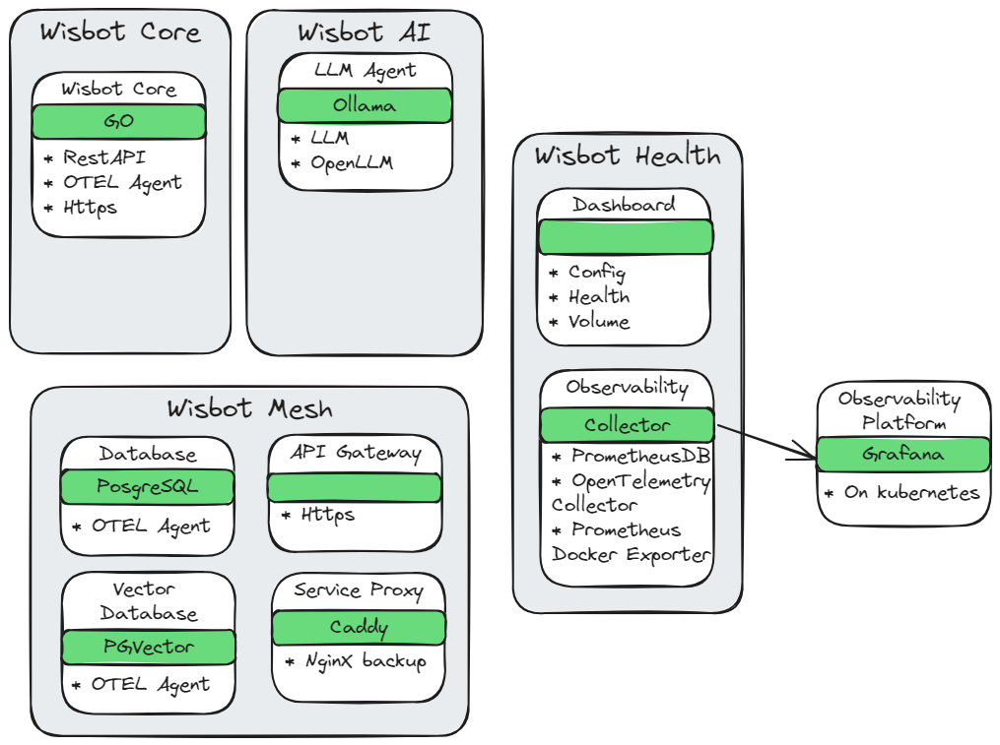

<!-- omit in toc -->
# Introduction & Table of Contents

<!-- omit in toc -->
## WisBot

WisBot is a multi-functional automation bot with several key components:

Discord Integration: WisBot connects to Discord through the Discord API, enabling command handling and message processing.
LLM Capabilities: The bot integrates with Ollama to provide large language model functionality, allowing users to interact with AI models.
File Management: WisBot includes a file upload/download system with database storage, user tracking, and automatic cleanup.
Web Server Interface: The bot offers a web interface built with Go templates for user interaction outside of Discord.
Observability: The system includes OpenTelemetry integration for monitoring and tracing.


- [Getting Started](#getting-started)
  - [Start using Wisbot with Commands](#start-using-wisbot-with-commands)
- [Architecture](#architecture)
  - [WisBot Design Architecture](#wisbot-design-architecture)
  - [User Experience Workflows](#user-experience-workflows)
- [Commands](#commands)
- [Core Beliefs](#core-beliefs)
- [Requirements \& Dependencies](#requirements--dependencies)
  - [Bot Dependencies](#bot-dependencies)
    - [Templ, SQLc \& Air](#templ-sqlc--air)
- [Running the bot](#running-the-bot)
  - [Running the bot using Go](#running-the-bot-using-go)
- [Prepare Linux (Ubuntu 22.04) for running Wisbot](#prepare-linux-ubuntu-2204-for-running-wisbot)
- [Setup Nvidia Drivers and Container Toolkit on Ubuntu 22.04](#setup-nvidia-drivers-and-container-toolkit-on-ubuntu-2204)
- [Using Docker to build and deploy Wisbot](#using-docker-to-build-and-deploy-wisbot)
  - [Building the Docker Image](#building-the-docker-image)
  - [Running the bot using docker-compose](#running-the-bot-using-docker-compose)
    - [Running the dockerfile with GPU acceleration enabled:](#running-the-dockerfile-with-gpu-acceleration-enabled)
- [Ollama Docker Image Documentation](#ollama-docker-image-documentation)
  - [Issues](#issues)
- [CRLF vs LF](#crlf-vs-lf)

## Getting Started

### Start using Wisbot with [Commands](#commands)

## Architecture

### WisBot Design Architecture



### User Experience Workflows


## Commands

`/wis help` - Shows the help message

`/wis upload` - Uploads a file to the server

`/wis llm` - Sends a request to the attached WisBot LLM


## Core Beliefs

Wisbot may never fail silently.
Wisbot must always trace errors with complete stack information.
Wisbot must return meaningful errors to users.
Wisbot must be fast and responsive.
Wisbot must handle resources efficiently.
Wisbot must enforce user quotas and limits.
Wisbot must cleanup expired resources automatically.
Wisbot must log telemetry when appropriate.
Wisbot must maintain separation of concerns.
Wisbot must be containerized and deployable.
Wisbot must be observable and monitorable.
Wisbot must communicate clearly with users.
Wisbot must keep data secure.
Wisbot must scale when needed.
Wisbot must fail gracefully when external systems are unavailable.


## Requirements & Dependencies
- Golang 1.23
- Templ (optional)
- Discord Token
- Ollama (optional)
- Llama3.2 model `ollama pull llama3.2`
- Nvidia Container Toolkit (optional)

### Bot Dependencies
After the installation of Go, the following tools are recommended for development. Please install them using the commands below:

#### Templ, SQLc & Air

- A language for writing HTML user interfaces in Go - https://github.com/a-h/templ
- Live reload for Go apps - https://github.com/air-verse/air
  
```sh
go install github.com/a-h/templ/cmd/templ@latest && go install github.com/air-verse/air@latest && go install github.com/sqlc-dev/sqlc/cmd/sqlc@latest
```

Run the following command to generate the Templ files for the bot:
```sh
templ generate
```

Run the following command to generate the SQLC files for the bot:
```sh
sqlc generate -f ./src/sql/sqlc.yaml
```

Then run air in the WisBot repository to update all required dependencies:
```sh
air
```

## Running the bot
> [!NOTE]
You will need a config.yaml file, if you don't have one, one will be created for you on the first run.
Please fill out the config. This is for Discord authentication. You can get the token from the Discord Developer Portal.

### Running the bot using Go

You can run the bot using the following command:
```sh
go run ./src
```

## Prepare Linux (Ubuntu 22.04) for running Wisbot

Remove any existing docker packages and conflicting dependencies:
```sh
for pkg in docker.io docker-doc docker-compose docker-compose-v2 podman-docker containerd runc; do sudo apt-get remove $pkg; done
```

Setup docker-apt repository:

```sh
# Add Docker's official GPG key:
sudo apt-get update
sudo apt-get install ca-certificates curl
sudo install -m 0755 -d /etc/apt/keyrings
sudo curl -fsSL https://download.docker.com/linux/ubuntu/gpg -o /etc/apt/keyrings/docker.asc
sudo chmod a+r /etc/apt/keyrings/docker.asc

# Add the repository to Apt sources:
echo \
  "deb [arch=$(dpkg --print-architecture) signed-by=/etc/apt/keyrings/docker.asc] https://download.docker.com/linux/ubuntu \
  $(. /etc/os-release && echo "$VERSION_CODENAME") stable" | \
  sudo tee /etc/apt/sources.list.d/docker.list > /dev/null
sudo apt-get update
```

Install docker:

```sh
sudo apt-get install docker-ce docker-ce-cli containerd.io docker-buildx-plugin docker-compose-plugin
```

Add the user to the docker group:

```sh
sudo usermod -aG docker $USER
```

Install Github Runner on Ubuntu 22.04

https://github.com/uhstray-io/WisBot/settings/actions/runners/new?arch=x64&os=linux

```sh
mkdir actions-runner && cd actions-runner
```

Download the latest runner package:

```sh
curl -o actions-runner-linux-x64-2.320.0.tar.gz -L https://github.com/actions/runner/releases/download/v2.320.0/actions-runner-linux-x64-2.320.0.tar.gz
```

Validate the Runner:

```sh
echo "93ac1b7ce743ee85b5d386f5c1787385ef07b3d7c728ff66ce0d3813d5f46900  actions-runner-linux-x64-2.320.0.tar.gz" | shasum -a 256 -c
```

Extract the runner:

```sh
tar xzf ./actions-runner-linux-x64-2.320.0.tar.gz
```

Configure the runner:

```sh
./config.sh --url <MY_URL> --token <MY_TOKEN>
```

Test the runner:

```sh
./run.sh
```

Setup the github runner as a service:

https://docs.github.com/en/actions/hosting-your-own-runners/managing-self-hosted-runners/configuring-the-self-hosted-runner-application-as-a-service

```sh
sudo ./svc.sh install
```

Start the github runner service:

```sh
sudo ./svc.sh start
```

Restart docker and enable the BuildKit to ensure compatibility with the deployment:

```sh
DOCKER_BUILDKIT=1
sudo systemctl restart docker
```

You can use the `stop` and `uninstall` commands to stop and uninstall the service.

## Setup Nvidia Drivers and Container Toolkit on Ubuntu 22.04

https://developer.nvidia.com/datacenter-driver-downloads?target_os=Linux&target_arch=x86_64&Distribution=Ubuntu&target_version=22.04&target_type=deb_network

Setup the Nvidia drivers GPG key:
```sh
wget https://developer.download.nvidia.com/compute/cuda/repos/ubuntu2204/x86_64/cuda-keyring_1.1-1_all.deb
sudo dpkg -i cuda-keyring_1.1-1_all.deb
sudo apt-get update
```

Install the OpenKernel Drivers:
```sh
sudo apt-get install -y nvidia-open-565
```

Add the container toolkit repository:
```sh
curl -fsSL https://nvidia.github.io/libnvidia-container/gpgkey | sudo gpg --dearmor -o /usr/share/keyrings/nvidia-container-toolkit-keyring.gpg \
  && curl -s -L https://nvidia.github.io/libnvidia-container/stable/deb/nvidia-container-toolkit.list | \
    sed 's#deb https://#deb [signed-by=/usr/share/keyrings/nvidia-container-toolkit-keyring.gpg] https://#g' | \
    sudo tee /etc/apt/sources.list.d/nvidia-container-toolkit.list
```

Configure Experimental Packages:
```sh
sudo sed -i -e '/experimental/ s/^#//g' /etc/apt/sources.list.d/nvidia-container-toolkit.list
```

Update the repository and install the Nvidia Container Toolkit:

```sh
sudo apt-get update && sudo apt-get install -y nvidia-container-toolkit
```

Configure the toolkit to use Docker:
```sh
sudo nvidia-ctk runtime configure --runtime=docker
```

Restart Docker:
```sh
sudo systemctl restart docker
```

## Using Docker to build and deploy Wisbot

### Building the Docker Image

Update the latest build of the wisbot:

```sh
docker build -t wisbot .
```

Running the dockerfile via Docker:

[docker run](https://docs.docker.com/reference/cli/docker/container/run/)

```sh
docker run -d wisbot
```

### Running the bot using docker-compose

[docker compose](https://docs.docker.com/compose/)

```sh
docker compose up -d
```

```sh
docker compose down
```

Running the WisBot via Docker Compose (testing workflow):

```sh
docker compose -f test-compose.yaml up
```

#### Running the dockerfile with GPU acceleration enabled:

Enable Nvidia Container Toolkit resources on Ubuntu 22.04 WSL:

[nvidia container toolkit](https://docs.nvidia.com/datacenter/cloud-native/container-toolkit/latest/install-guide.html#prerequisites)

```sh
curl -fsSL https://nvidia.github.io/libnvidia-container/gpgkey | sudo gpg --dearmor -o /usr/share/keyrings/nvidia-container-toolkit-keyring.gpg && curl -s -L https://nvidia.github.io/libnvidia-container/stable/deb/nvidia-container-toolkit.list | sed 's#deb https://#deb [signed-by=/usr/share/keyrings/nvidia-container-toolkit-keyring.gpg] https://#g' | sudo tee /etc/apt/sources.list.d/nvidia-container-toolkit.list
```

Update the package list and install the Nvidia Container Toolkit:

```sh
sudo apt-get update && sudo apt-get install -y nvidia-container-toolkit
```

Configure Docker to use the nvidia-container-toolkit:

```sh
sudo nvidia-ctk runtime configure --runtime=docker && sudo systemctl restart docker
```

Run the image with GPU acceleration:

```sh
docker run -d wisbot --gpus all ubuntu nvidia-smi
```

https://docs.docker.com/desktop/gpu/

## Ollama Docker Image Documentation
https://hub.docker.com/r/ollama/ollama 


### Issues
## CRLF vs LF

```sh
git config core.eol lf
git config core.autocrlf input
```